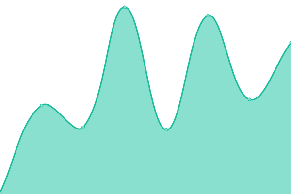
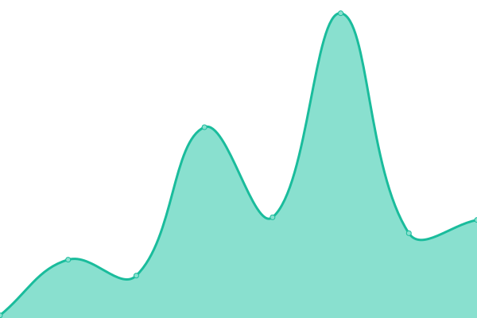

# [📈 Live Status](https://danielitogomez.github.io/upptime): <!--live status--> **🟩 All systems operational**

This repository contains the open-source uptime monitor and status page for [Daniel Gómez Amarán](https://www.helloworld-it.com/), powered by [Upptime](https://github.com/upptime/upptime).

With [Upptime](https://upptime.js.org), you can get your own unlimited and free uptime monitor and status page, powered entirely by a GitHub repository. We use [Issues](https://github.com/danielitogomez/upptime/issues) as incident reports, [Actions](https://github.com/danielitogomez/upptime/actions) as uptime monitors, and [Pages](https://danielitogomez.github.io/upptime) for the status page.

<!--start: status pages-->
<!-- This summary is generated by Upptime (https://github.com/upptime/upptime) -->
<!-- Do not edit this manually, your changes will be overwritten -->
<!-- prettier-ignore -->
| URL | Status | History | Response Time | Uptime |
| --- | ------ | ------- | ------------- | ------ |
|  [My CV Production](https://danielitogomez.github.io/my-cv/) | 🟩 Up | [my-cv-production.yml](https://github.com/danielitogomez/upptime/commits/HEAD/history/my-cv-production.yml) | 

 88ms
     
 | 

<a href="https://danielitogomez.github.io/upptime/history/my-cv-production">100.00%</a>
    

|  [DulceDimagio Prod](https://website-6e553.web.app/) | 🟩 Up | [dulce-dimagio-prod.yml](https://github.com/danielitogomez/upptime/commits/HEAD/history/dulce-dimagio-prod.yml) | 

 121ms
     
 | 

<a href="https://danielitogomez.github.io/upptime/history/dulce-dimagio-prod">100.00%</a>
    

|  [Blog Hello-World-it Prod](https://helloworld-it.onrender.com/) | 🟩 Up | [blog-hello-world-it-prod.yml](https://github.com/danielitogomez/upptime/commits/HEAD/history/blog-hello-world-it-prod.yml) | 

 299ms
     
 | 

<a href="https://danielitogomez.github.io/upptime/history/blog-hello-world-it-prod">100.00%</a>
    

|  [Homepage Prod](https://danielitogomez.github.io/) | 🟩 Up | [homepage-prod.yml](https://github.com/danielitogomez/upptime/commits/HEAD/history/homepage-prod.yml) | 

 49ms
     
 | 

<a href="https://danielitogomez.github.io/upptime/history/homepage-prod">100.00%</a>
    

|  [DevOps App Roadmap Prod](https://roadmap-app.onrender.com/) | 🟩 Up | [dev-ops-app-roadmap-prod.yml](https://github.com/danielitogomez/upptime/commits/HEAD/history/dev-ops-app-roadmap-prod.yml) | 

 5074ms
     
 | 

<a href="https://danielitogomez.github.io/upptime/history/dev-ops-app-roadmap-prod">97.20%</a>
    

<!--end: status pages-->

[**Visit our status website →**](https://danielitogomez.github.io/upptime)

## 📄 License

- Powered by: [Upptime](https://github.com/upptime/upptime)
- Code: [MIT](./LICENSE) © [Daniel Gómez Amarán](https://www.helloworld-it.com/)
- Data in the `./history` directory: [Open Database License](https://opendatacommons.org/licenses/odbl/1-0/)
